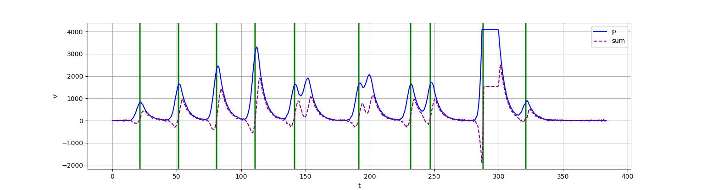
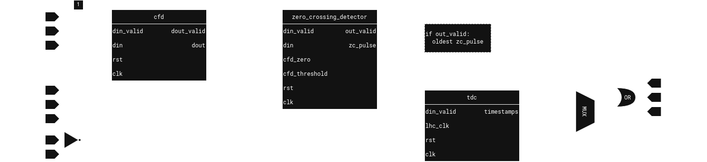

# CFD

## Overview

A real-time [constant fraction discriminator](https://en.wikipedia.org/wiki/Constant_fraction_discriminator#) written in SystemVerilog. The design assumes a very fast ADC running at 2Gsps at the input, with samples coming in via SerDes in blocks of `DATA_MUX=16` samples. This requires an FPGA clock speed at 125MHz, which is realistic. The output of the CFD are timestamps, with accuracy as that of the ADC sample rate, published after a pipeline delay of 3 FPGA clock cycles.

The project is separated into the `cfd` IPcore (data sent over AXI-Stream), and the `cfd_overlay` - block design for use with PYNQ. The IPcore has been simulated, adding randomised breaks in input data, with the results displayed on the plot below (compensated for the delay and breaks).



The diagram below shows the inner structure of the IPcore:



The `cfd` module is responsible for performing the delay buffering and arithmetical calculations (input: blue, output: purple) - it introduces a delay of 2 clock cycles. The `zero_crossing_detector` module detects zero crossings, with hysteresis for noise immunity, emitting a pulse for the sample at which the crossing occurred. These pulses are then used to extract event timestamps generated by `tdc`, which are sent to the output (green lines).


[Python prototype](https://colab.research.google.com/drive/169wsArsvZh4bEdJta2ckro3zzxF1lknP?usp=sharing) used for tuning CFD parameters and generating input pulses. File is also availabe inside the `analysis` folder for local use.

## Run simulation
CFD module only, using `verilator` for synthesis. Use `plot.py` inside analysis folder to preview the output values of the CFD, with noise-immune zero-crossing detector.
``` bash
./verilate.sh
```

## Vivado
Use TCL scripts to reconstruct the projects.
```powershell
write_bd_tcl -force [get_property directory [current_project]]/rebuild_bd.tcl
write_project_tcl -paths_relative_to [get_property directory [current_project]] -force [get_property directory [current_project]]/rebuild_project.tcl
```
